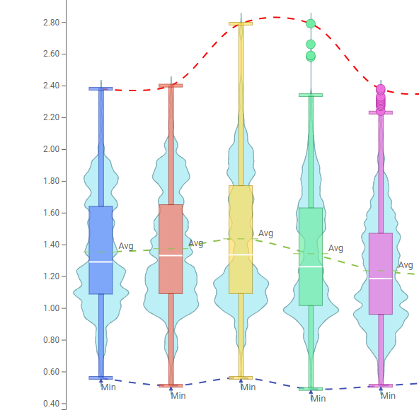

# Violin Plot Mod for Spotfire®

A visual representation of data distribution, combining the advantages of both box plots and kernel density plots to allow easy comparison of distributions of sets of data, and enabling the simultaneous display of the underlying data density and summary statistics.

## Installation & Use

[Download latest version](https://github.com/spotfiresoftware/spotfire-mod-violin/releases)

The [Wiki](https://github.com/spotfiresoftware/spotfire-mod-violin/wiki) contains step-by-step instruction on how to install and use this Mod in Spotfire®.

## Building the Project

In a terminal window:
- `npm install`
- `npm run build-watch`

In a new terminal window:
- `npm run server`

### Building for production

The development version of bundle.js is uncompressed and not suitable for end-users. Run the following command to compress the bundle:
- `npm run build`

## About Mods for Spotfire®
-   [Spotfire Community Exchange](https://community.spotfire.com/files/category/7-visualization-mods/): A safe and trusted place to discover ready-to-use mods
-   [Developer documentation](https://spotfiresoftware.github.io/spotfire-mods/docs/): Introduction and tutorials for mods developers
-   [Mods examples](https://github.com/TIBCOSoftware/spotfire-mods): A public repository for examples projects
